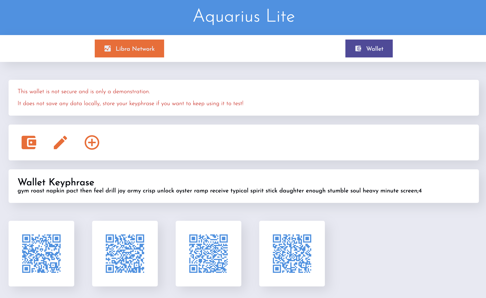

# Aquarius Wallet

Intended for testnet use right now.
Currently a POC with no regards for security and no custodial design.

## Common

Contains shared code and types and proto files

## Client

Contains the test frontend website for Aquarius-Wallet. It is a POC and needs heavy refactoring for real use.

## Server

Contains the test backend for Aquarius-Wallet.

Components:

- gRPC client
  - Currently only admission_control is open on testnet grpc
  - BIG TODO
- API Endpoints
  - Wallet (Create, Import, NewAddress)
  - Transactions (Send, Mint) TODO
  - User Accounts w/ Authentication for wallet handling TODO (use facebook accounts?)
  - LedgerQuerying (UpdateLedger, Transaction Histories for Addresses) TODO
- Wallet

  - Based on [libra_wallet](https://github.com/libra/libra/tree/master/client/libra_wallet)
  - Needs to handle: ~~Creation~~, ~~Import~~, Transactions, ~~Address Generation,~~ Secure key handling, and custodial user accounts integration
  - Needs big refactor for handling next_gen crypto elegantly and error handling

Current frontend should look something like this if you run it right:

